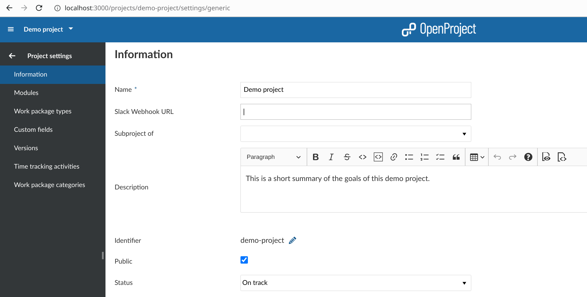

# OpenProject Slack Plugin

Provides a very rudimentary slack integration.
All it does right now is post updates in configured slack channels when ever a
work package or a wiki page is updated.

## Installation

Please refer to the [documentation](https://docs.openproject.org/installation-and-operations/configuration/plugins/#adding-plugins-debrpm-packages) to see how to install plugins in general.

Do as shown in the documentation with the following custom Gemfile:

```
group :opf_plugins do
  gem "openproject-slack", git: "https://github.com/opf/openproject-slack.git", branch: "dev"
end
```

## Configuration

Once the plugin is installed you can configure it under [/settings/plugin/openproject_slack](http://localhost:3000/settings/plugin/openproject_slack).

There you configure the Slack [incoming webhook URL](https://api.slack.com/messaging/webhooks) you want to use by default.

You can customize this on a per-project basis using the project settings of each project.



You can see the *Slack Webhook URL* setting right after the project name. Insert your URL there.
If none is set the global defined before is used.

## Issue Tracker

https://community.openproject.org/projects/slack/work_packages
